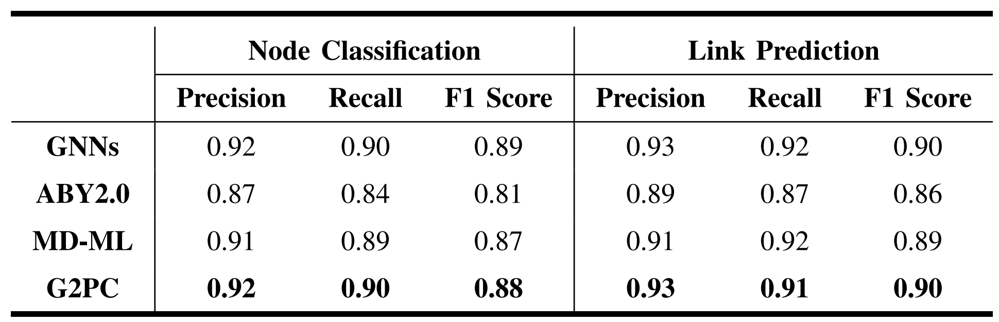
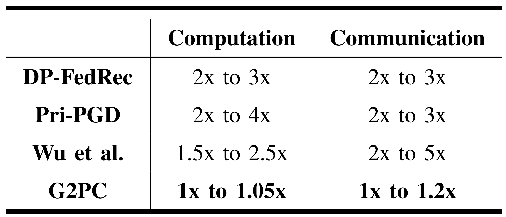
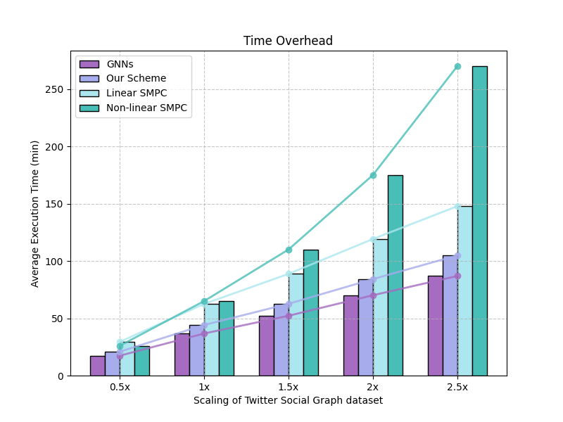
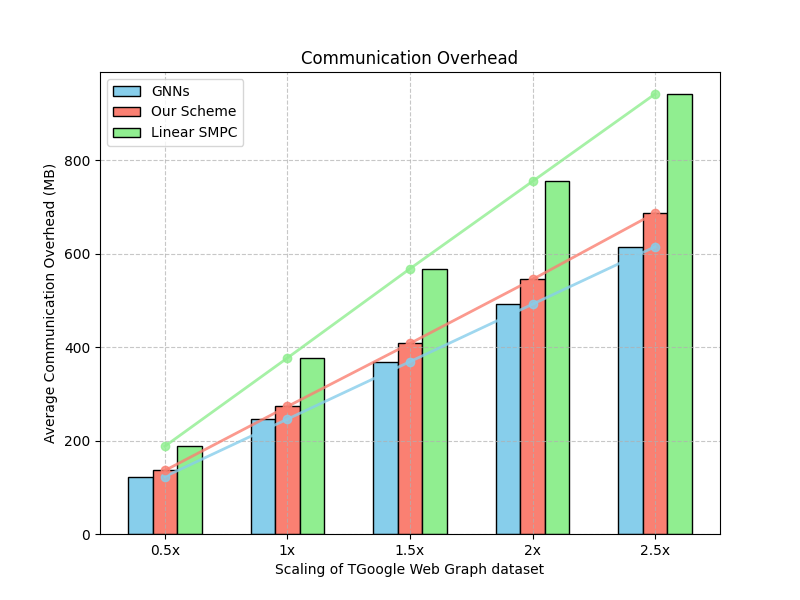
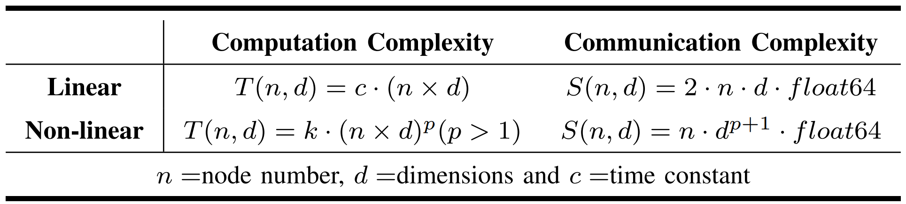

## 812B_Response
About accuracy, we set up precision, recall, and the F1 score for evaluation.

## 812C_Response

## 812D_Response
SLT achieves linear time complexity and is at least 29.09% faster than linear and nonlinear MPC protocols.

SLT involves two communication rounds with a linear space complexity, outperforming scenarios with non-linear complexity, also has a smaller time constant than other linear protocols(At least 27.65% less).

Computational and communication complexity

