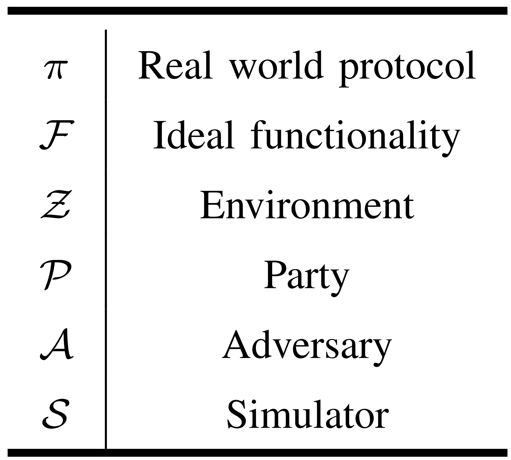
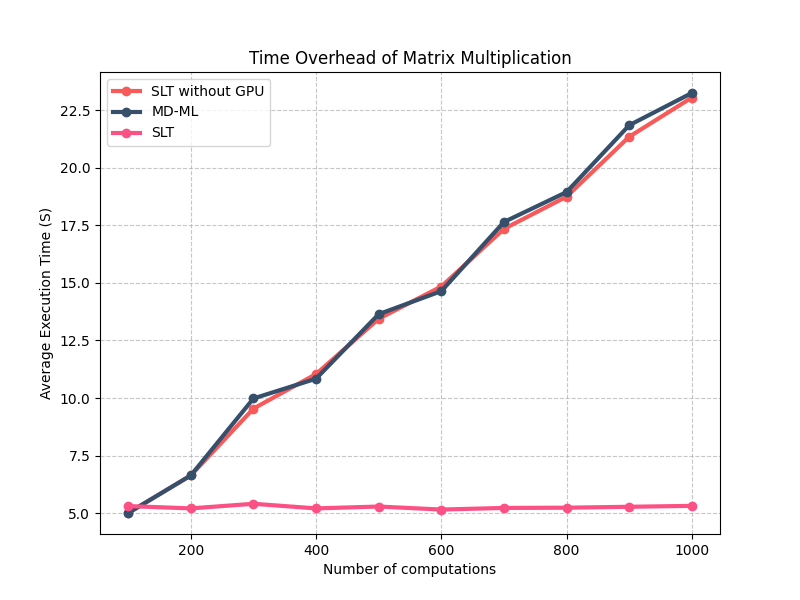
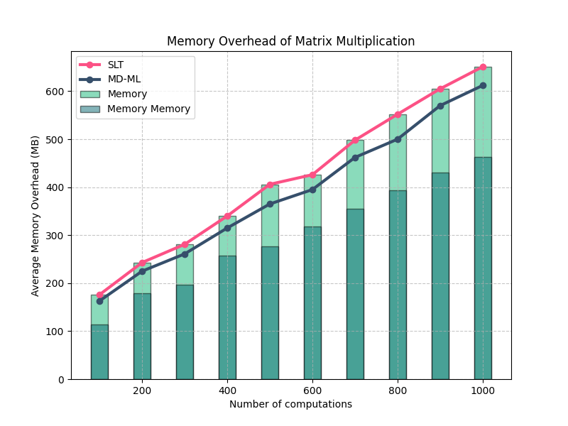
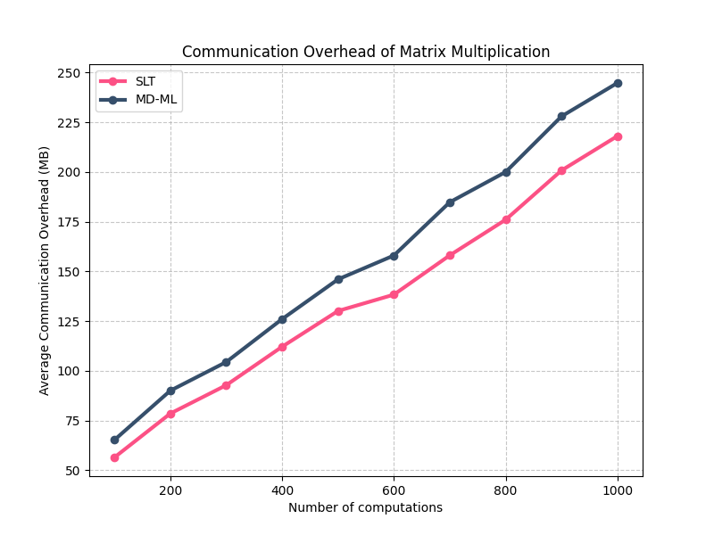
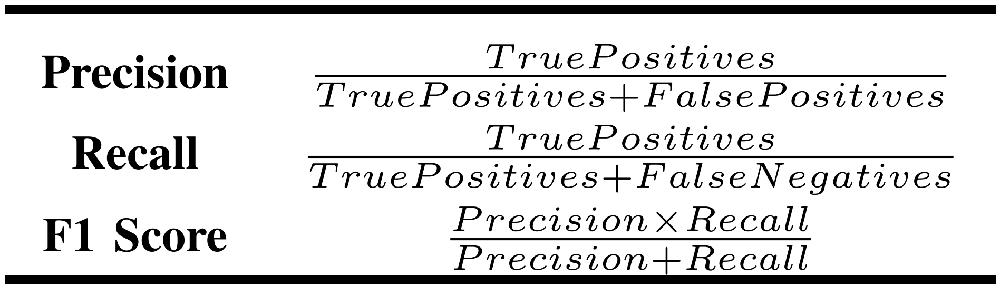

## C2: Security Proof (812A, 812D)
#### Table C: UC framework

## 812A_Response
#### Existing Work
[1] S. Wang, Y. Zheng, and X. Jia, "Secgnn: Privacy-preserving graph neural network training and inference as a cloud service," IEEE Transactions on Services Computing, vol. 16, no. 4, pp. 2923–2938, 2023.

[2] R. Ran, N. Xu, T. Liu, W. Wang, G. Quan, and W. Wen, "Penguin: Parallel-packed homomorphic encryption for fast graph convolutional network inference," in Advances in Neural Information Processing Systems, A. Oh, T. Naumann, A. Globeron, K. Saenko, M. Hardt, and S. Levine, Eds., vol. 36. Curran Associates, Inc., 2023, pp. 19104–19116. Available: https://proceedings.neurips.cc/paper_files/paper/2023/file/3cc685788a31f1a35d8d41df93e288ca-Paper-Conference.pdf

[3] H. Wang, S. Cai, P. Liu, J. Zhang, Z. Shen, and K. Liu, "Dp-stgat: Traffic statistics publishing with differential privacy and a spatial-temporal graph attention network," Inf. Sci., vol. 623, no. C, pp. 258–274, Apr 2023. Available: https://doi.org/10.1016/j.ins.2022.11.053

#### Time overhead

#### Memory overhead

#### Communication overhead

## 812B_Response
#### About accuracy, we set up precision, recall, and the F1 score for evaluation.

## 812C_Response
#### Overheads on existing work

#### Computation

#### Communication

## 812D_Response
#### SLT achieves linear time complexity and is at least 29.09% faster than linear and nonlinear MPC protocols.

#### SLT involves two communication rounds with a linear space complexity, outperforming scenarios with non-linear complexity, also has a smaller time constant than other linear protocols(At least 27.65% less).

#### Computational and communication complexity

